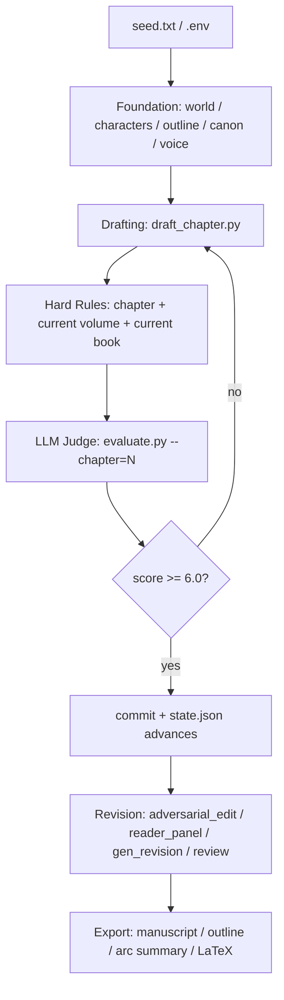
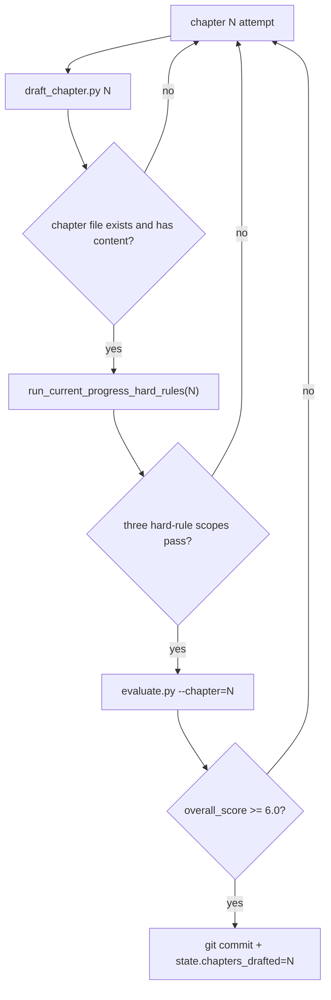

# 当前项目架构与章节执行流程

本文档记录当前 `autonovel` 项目的实际代码结构、单章测试流程，以及完整章节生成流程。它以当前脚本为准，旧的 `README.md`、`PIPELINE.md`、`WORKFLOW.md` 可作为背景说明。

## 1. 架构总览

项目是一个“生成 - 检查 - 评分 - 保留/重试 - 修订 - 导出”的小说自动化管线。核心入口是 `run_pipeline.py`，单个能力由独立脚本实现。



## 2. 主要模块

| 模块 | 文件 | 职责 |
| --- | --- | --- |
| 总控编排 | `run_pipeline.py` | 管理阶段、状态、重试、硬规则、评分、提交、修订、导出 |
| LLM 适配 | `llm.py` | 统一 Anthropic 兼容接口和 Gemini REST 接口，支持 writer/judge/review 分角色配置 |
| 基础设定生成 | `gen_world.py`, `gen_characters.py`, `gen_outline.py`, `gen_outline_part2.py`, `gen_canon.py`, `voice_fingerprint.py` | 从种子生成世界、人物、大纲、伏笔、真相和文风 |
| 单章写作 | `draft_chapter.py` | 读取设定层、当前章大纲、前章结尾、下一章大纲，生成 `chapters/ch_NN.md` |
| 单章修订 | `gen_revision.py` | 根据 brief 重写指定章节，并读取相邻章节维持连续性 |
| 机械与 LLM 评分 | `evaluate.py` | 机械 slop 检测 + LLM judge，支持 foundation、chapter、full 三种模式 |
| 硬规则闸门 | `tools/chapter_hard_rules.py`, `tools/volume_hard_rules.py`, `tools/book_hard_rules.py` | 不调用 LLM，按章节/卷/全书范围检查真相释放、禁用词、必达节点 |
| 深度修订 | `adversarial_edit.py`, `apply_cuts.py`, `reader_panel.py`, `review.py`, `gen_brief.py` | 找冗余、读者面板、Opus/评审模型审稿、生成修订 brief |
| 导出 | `build_outline.py`, `build_arc_summary.py`, `typeset/build_tex.py` | 从章节重建文档、合并 manuscript、生成排版内容 |

## 3. 数据与状态文件

| 路径 | 含义 |
| --- | --- |
| `.env` | API key、provider、model、base URL 配置。不要提交真实 key |
| `state.json` | 当前阶段、已完成章节数、总章节数、分数、修订轮次 |
| `seed.txt` | 小说种子 |
| `world.md`, `characters.md`, `outline.md`, `canon.md`, `voice.md`, `MYSTERY.md` | 设定层和约束层 |
| `chapters/ch_NN.md` | 正文章节 |
| `results.tsv` | 每次 keep/discard/forced/export 的结果记录 |
| `eval_logs/*.json` | `evaluate.py` 的完整评分日志 |
| `edit_logs/*.json` | adversarial edit、reader panel、review 等修订日志 |
| `briefs/*.md` | 修订 brief |
| `manuscript.md`, `typeset/*` | 导出产物 |

## 4. LLM 配置模型

所有 LLM 脚本通过 `llm.py` 调用模型。代码按角色区分 provider：

| 角色 | 用途 | 主要环境变量 |
| --- | --- | --- |
| writer | 写章节、写修订、生成设定 | `AUTONOVEL_WRITER_PROVIDER`, `AUTONOVEL_GEMINI_WRITER_MODEL`, `AUTONOVEL_ANTHROPIC_WRITER_MODEL` |
| judge | 单章/全书评分、adversarial edit、reader panel | `AUTONOVEL_JUDGE_PROVIDER`, `AUTONOVEL_GEMINI_JUDGE_MODEL`, `AUTONOVEL_ANTHROPIC_JUDGE_MODEL` |
| review | 全书深度审稿 | `AUTONOVEL_REVIEW_PROVIDER`, `AUTONOVEL_GEMINI_REVIEW_MODEL`, `AUTONOVEL_ANTHROPIC_REVIEW_MODEL` |

常见配置是 Gemini 负责写作，Anthropic 兼容模型或 `astron-code-latest` 负责 judge/review。这样可以让“写”和“审”使用不同模型，减少同模型自评偏差。

当前管线默认是串行执行：一章写完后才进入硬规则和 LLM 评分；`reader_panel.py` 也是逐个 persona 调用。除非手动并行启动多个脚本，否则不会自然产生大量并发请求。

## 5. 测试章节执行流程

测试单章时，不建议直接跑完整 `run_pipeline.py --phase drafting`，因为它会从 `state.json` 的 `chapters_drafted + 1` 开始，持续生成到计划总章数。测试一章应手动执行以下流程。

以第 2 章为例：

```bash
cd /Users/sh/Documents/codeSpace/crewAI/autonovel

# 1. 写单章
uv run python draft_chapter.py 2

# 2. 写完后立刻跑三层确定性硬规则
uv run python tools/chapter_hard_rules.py --chapter 2
uv run python tools/volume_hard_rules.py --chapter 2
uv run python tools/book_hard_rules.py --through-chapter 2

# 3. 只有硬规则通过后，才做 LLM 章节评分
uv run python evaluate.py --chapter=2
```

测试流程的判定顺序：

1. `draft_chapter.py N` 生成 `chapters/ch_NN.md`。
2. `chapter_hard_rules.py --chapter N` 检查当前章自身的真相释放和必达节点。
3. `volume_hard_rules.py --chapter N` 根据当前章推导所在卷，只扫描当前卷从卷首到第 N 章的内容。
4. `book_hard_rules.py --through-chapter N` 扫描从第 1 章到第 N 章的部分全书，并只启用已经到期的全书节点。
5. 三层硬规则任一失败，本章应视为未通过，不进入 LLM 评分或需要重新生成/修订。
6. 硬规则通过后，`evaluate.py --chapter=N` 执行机械 slop 检测和 LLM judge 评分，并写入 `eval_logs/`。

这个流程不会自动更新 `state.json`，也不会自动提交 git。它适合验证 prompt、provider、硬规则和评分是否按预期工作。

## 6. 完整章节执行流程

完整章节生成由 `run_pipeline.py` 的 `drafting` 阶段负责：

```bash
cd /Users/sh/Documents/codeSpace/crewAI/autonovel

# 从当前 state.json 恢复，按 state.phase 继续
uv run python run_pipeline.py

# 只跑章节生成阶段
uv run python run_pipeline.py --phase drafting

# 从 seed.txt 重新开始完整管线
uv run python run_pipeline.py --from-scratch
```

章节总数由 `get_total_chapters()` 决定：

1. 如果 `state.json` 里 `chapters_total > 0`，优先使用它。
2. 否则从 `outline.md` 中匹配 `### Ch N` 或 `### Chapter N`，取最大章节号。
3. 如果无法推断，默认 24 章。

当前黑虹硬规则按 50 章、5 卷设计。因此，如果要完整生成 50 章，需要保证 `state.json` 或 `outline.md` 中的计划章节数是 50。否则完整 drafting 不一定会生成 50 章。

每章的自动尝试流程如下：



具体规则：

1. 从 `state["chapters_drafted"] + 1` 开始，一直生成到 `total`。
2. 每章最多尝试 `MAX_CHAPTER_ATTEMPTS = 5` 次。
3. 每次写完章节后，立即运行三层硬规则：
   - 单章：`tools/chapter_hard_rules.py --chapter N`
   - 当前卷：`tools/volume_hard_rules.py --volume V --through-chapter N`
   - 当前全书进度：`tools/book_hard_rules.py --through-chapter N`
4. 硬规则失败时，本次 attempt 在 LLM 评分前被丢弃并重试。
5. 硬规则通过后才调用 `evaluate.py --chapter=N`。
6. `overall_score >= 6.0` 时，提交 git、写 `results.tsv`、推进 `state.json`。
7. 分数低于 6.0 时，丢弃该 attempt 并重试。
8. 如果 5 次都因硬规则失败，管线抛错停止。
9. 如果 5 次都只是分数不达标，当前代码会保留最后一次 best-effort 并继续。

所有章节写完后，drafting 阶段还会做完整范围硬规则：

```bash
uv run python tools/volume_hard_rules.py --require-complete
uv run python tools/book_hard_rules.py --require-complete
```

这一步会把缺章也视为错误，并强制检查每卷、整本书的必达节点。

## 7. 完整管线执行流程

`run_pipeline.py` 有四个阶段：

| 阶段 | 入口 | 退出条件 |
| --- | --- | --- |
| foundation | `run_foundation()` | 生成设定层并评估，分数达到阈值或达到最大迭代 |
| drafting | `run_drafting()` | 所有计划章节生成完成，并通过完整硬规则 |
| revision | `run_revision()` | 3 到 6 轮自动修订后分数平台，随后最多 4 轮 review loop |
| export | `run_export()` | 全书硬规则通过后，生成 manuscript、outline、arc summary、排版内容 |

完整流程：

1. `--from-scratch` 时重置 `state.json`，要求 `seed.txt` 存在。
2. foundation 循环生成 `world.md`、`characters.md`、`outline.md`、`canon.md`、`voice.md`，并用 `evaluate.py --phase=foundation` 评分。
3. drafting 逐章生成正文，每章执行三层硬规则和 LLM judge，合格才推进。
4. drafting 完成后执行完整卷级和全书硬规则。
5. revision 开始前再次执行完整全书硬规则。
6. 每轮 revision 执行：
   - `adversarial_edit.py all`
   - `apply_cuts.py all --types OVER-EXPLAIN REDUNDANT --min-fat 15`
   - `reader_panel.py`
   - 从 consensus 生成 brief
   - `gen_revision.py N brief.md`
   - 修订后重新跑单章、当前卷、全书硬规则
   - `evaluate.py --chapter=N`
   - `evaluate.py --full`
7. novel score 平台化后，进入 review loop。
8. review loop 执行 `review.py --output reviews.md`、`review.py --parse`、`gen_brief.py --auto`、`gen_revision.py`、硬规则和机械清理。
9. export 前再次执行完整全书硬规则。
10. export 生成 `manuscript.md`，重建 outline / arc summary，并尝试生成 LaTeX/PDF。

## 8. 硬规则闸门说明

硬规则是确定性的，不调用 LLM。当前分三层：

| 层级 | 脚本 | 何时使用 | 当前核心职责 |
| --- | --- | --- | --- |
| 单章 | `tools/chapter_hard_rules.py` | 每章写完、每章修订后 | 检查章节号对应的 reveal gate、禁用提前泄露、指定章节必达信息 |
| 单卷 | `tools/volume_hard_rules.py` | 每章写完、每章修订后、drafting 完成后 | 检查当前卷的禁用释放和卷终必达节点 |
| 整书 | `tools/book_hard_rules.py` | 每章写完、修订前后、导出前 | 检查全书级禁用结局、官方英雄不可被改造、阶段性必达节点 |

每章写完后的正确调用顺序是：

```bash
uv run python tools/chapter_hard_rules.py --chapter N
uv run python tools/volume_hard_rules.py --chapter N
uv run python tools/book_hard_rules.py --through-chapter N
```

其中 `N` 决定当前应该启用哪些规则。例如第 2 章不会要求第 20 章的“数据缺失”已经出现，但会禁止第 20 章前不应泄露的核心真相。

## 9. 何时会生成全部 50 章

完整管线不是固定写 50 章，而是写到 `total`：

- 如果 `state.json` 的 `chapters_total` 是 50，会从当前进度写到第 50 章。
- 如果 `outline.md` 最大章节号是 50，并且 `state.json` 没有覆盖，也会写到第 50 章。
- 如果 `chapters_total` 或 `outline.md` 只规划到别的数字，就只写到该数字。
- 但完整硬规则当前按 50 章检查全书，因此最终完整硬规则会要求 1-50 章都存在。

因此黑虹项目要跑完整 50 章，应先确认：

```bash
uv run python -c "import json; s=json.load(open('state.json')); print(s.get('chapters_total'))"
rg -n "### (Ch|Chapter)\\s*50" outline.md
```

如果两个检查都不能证明总章数是 50，需要先修正 `state.json` 或 `outline.md`。

